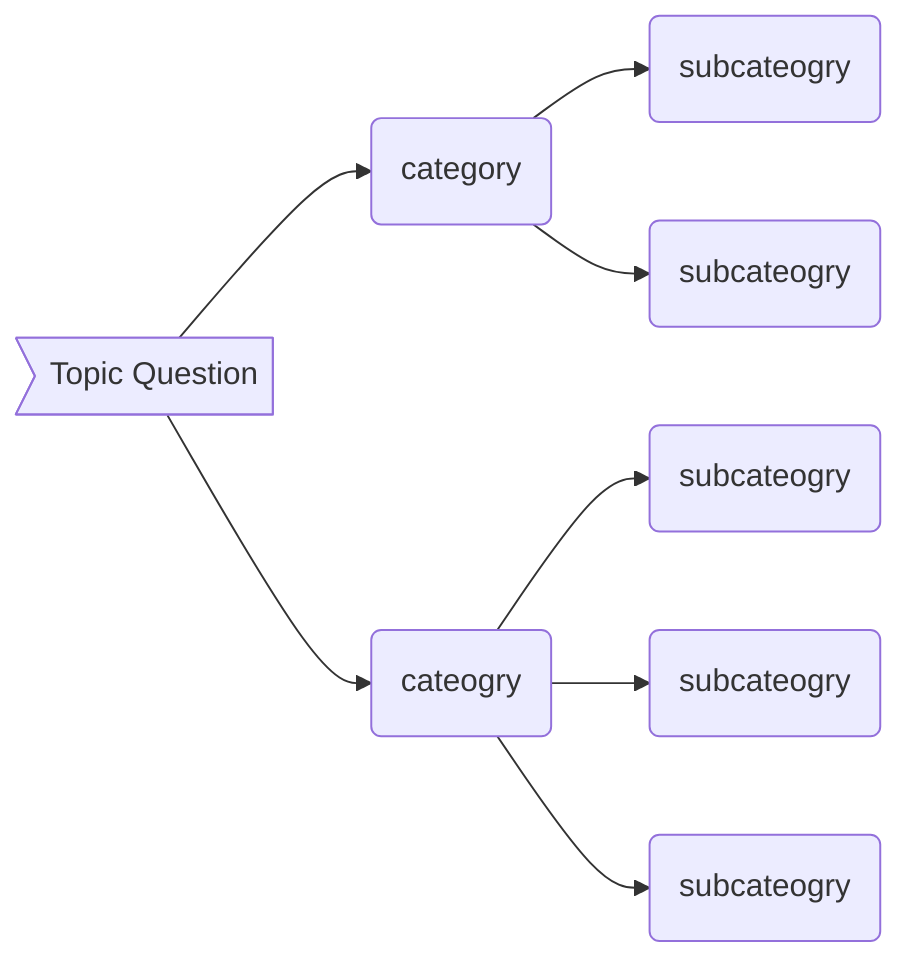

import {
  topicQuestionDef,
  completenessDef,
  relevanceDef,
  guidanceDef,
} from "/snippets/definitions.mdx";

## Introduction

<Tip>Looking for the [API reference](/api-reference/followups/create)?</Tip>

Aftercare takes a relationship based approach to categorization / coding survey responses. We believe that themes and sub-themes 
are best defined by the relationships between them. 

Aftercare uses a tree of themes and sub-themes to code survey responses and will place the response in the most specific category.

## Tree Maintenance  <Icon icon="tree" iconType="duotone"/>

Like any tree, new sprouts and branches will grow and old branches will die. Similarly, we expect that your categories and codes will also evolve over time.

Aftercare gives you a spectrum of control over your tree, from fully automatic to fully manual.

<CardGroup cols={3}>
  <Card title="Take the wheel" icon="tree-christmas">
    Aftercare will auto-magically create new themes and sub-themes for you as responses are coded. Let your tree grow organically and naturally.
  </Card>
  <Card title="Bonsai Trees" icon="tree-decorated">
    Mould the shape you want your tree to take, and let Aftercare grow the leaves and sprouts. Lock down the branches you want to keep and let others get auto-generated.
  </Card>
  <Card title="Manual" icon="tree">
    Manually create the themes and sub-themes and lock them down. Aftercare will not create new themes or sub-themes.
  </Card>
</CardGroup>

## Tree Growth <Icon icon="bag-seedling" iconType="duotone"/>

Aftercare will provide sane default to grow your tree, but we also support a bring your own fertilizer approach. 
Tree growth is determine by a few parameters and tuning these knobs will change the shape of your tree.

| property                 | description                                                      |
|--------------------------|------------------------------------------------------------------|
| `max levels`             | how tall your tree is                                            |
| `max codes per level`    | how wide each branch gets                                        |
| `min codes per response` | when create new themes, how many response are required to do so? |

## Climbing the Tree <Icon icon="monkey" iconType="duotone"/>

When a response is coded, Aftercare will start climbing the tree to find the right codes to visit. 
At every branching path, there are a lot of decisions to make. This section will given an idea of how we traverse the tree,
but it is not exhaustive to the logic that goes into making these decisions.

<Steps>
  <Step title="Data Quality">
    Is the response gibberish? Are there multiple components to the response that could be interpreted as different themes?
  </Step>
  <Step title="Evaluate">
    Does this response match any of the existing themes? Should we create a new theme? Can we create a new theme?
  </Step>
  <Step title="Repeat">
    Determine if we should repeat the process for each branch. 
  </Step>
</Steps>
